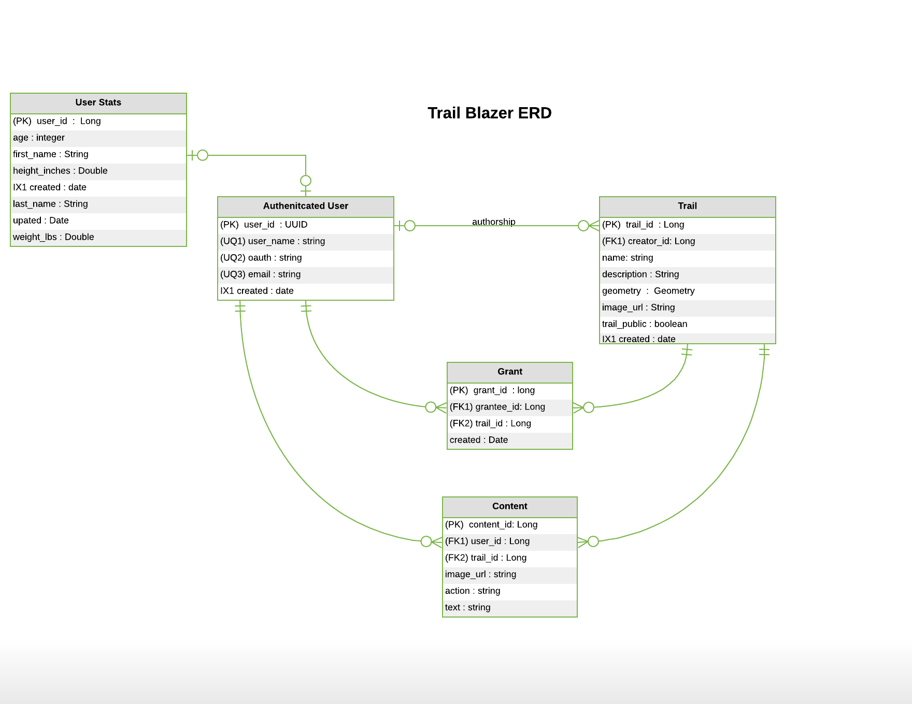

## Entity Relationship Diagram 

<<<<<<< HEAD

=======

>>>>>>> 872f1509d85025bc40ba5784ac190dc5e2083811

### Links to Entity Source Code

[`Trail`](https://github.com/the-trail-blazer/trailblazer-service/blob/master/src/main/java/io/trailblazer/trailblazerservice/model/entity/Trail.java)

[`User`](https://github.com/the-trail-blazer/trailblazer-service/blob/master/src/main/java/io/trailblazer/trailblazerservice/model/entity/User.java)

[`Grant`](https://github.com/the-trail-blazer/trailblazer-service/blob/master/src/main/java/io/trailblazer/trailblazerservice/model/entity/Grant.java)